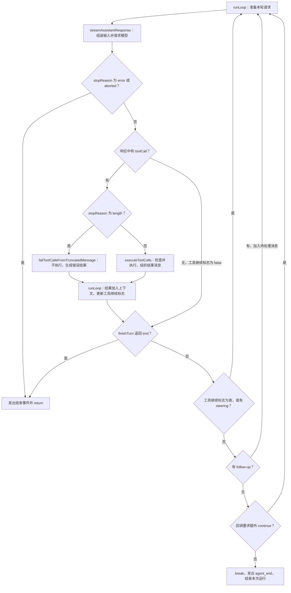
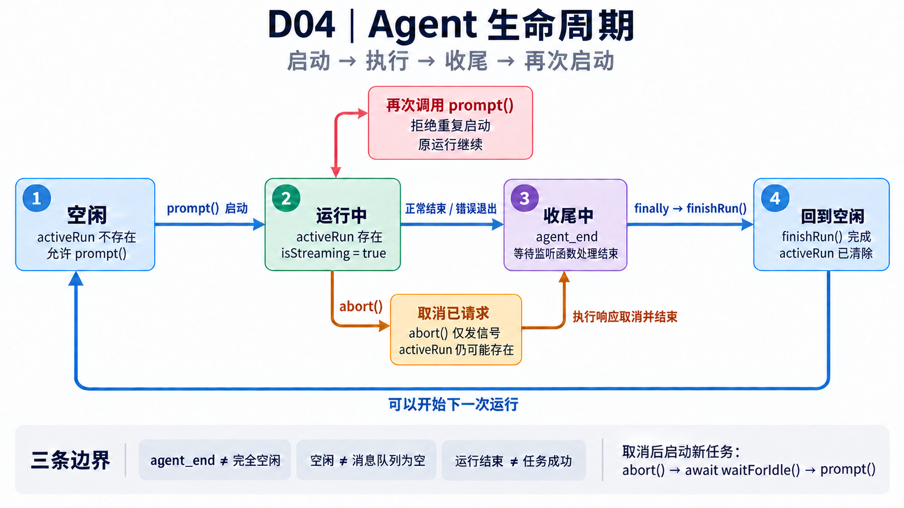
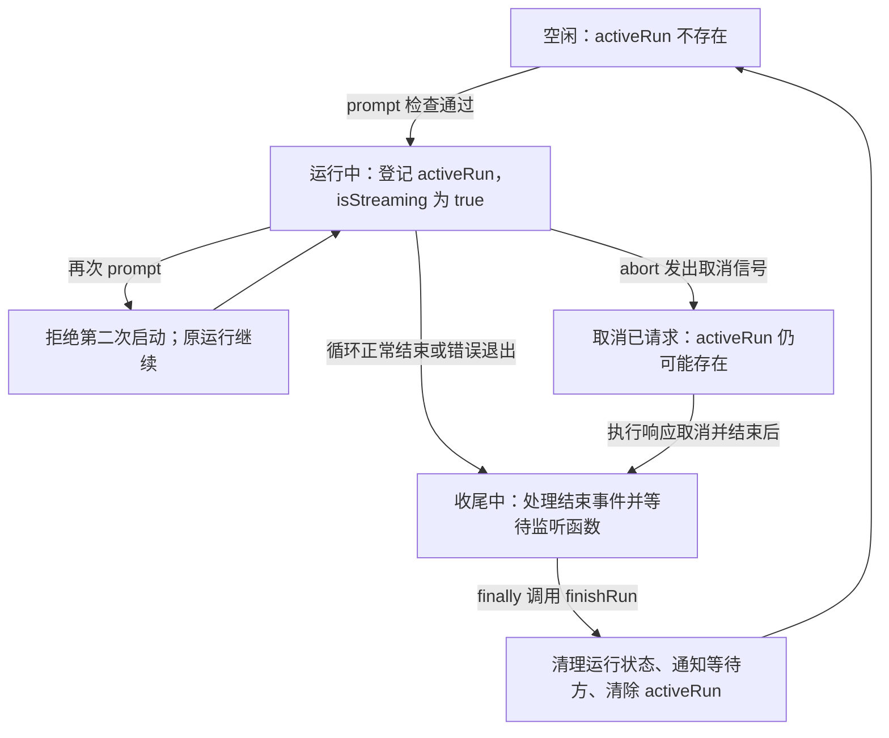

# Pi 阅读与 Python 实现路线

[当前进度](#当前进度与下一步) · [步骤总表](#步骤总表) · [第一周任务](#第一周-理解并实现单-agent-循环) · [交付清单](#里程碑与第一版交付清单) · [学习记录](#学习记录)

从一次具体任务出发：给 agent 一个有 bug 的 Python 小项目，让它读取代码、运行测试、修改文件，再确认测试结果。一个月后，完成 Mini-Pi v0.1，并能用源码、执行记录和实验数据解释自己的 agent 编排与 harness 设计。

本路线面向已有 AI 应用开发实习经验、了解 agent 和 harness 基础、主要使用 Python 的学习者。先理解并实现单 agent，再加入一个 reviewer 子 agent。每一步都写明现在该做什么、核对什么证据，以及这一步要解决什么问题。

## 当前进度与下一步

| 项目 | 当前记录 |
| --- | --- |
| 最后维护日期 | 2026-10-09 |
| 路线版本 | 初版 跨设备同步 |
| 学习开始日期 | 2026-10-08 |
| 已完成学习步骤 | 4 / 30 |
| 当前步骤 | D05 建立 Python 消息与工具接口 |
| 当前状态 | 待开始 |
| 远程仓库 | [bakeyliao-boop/Mini-Pi](https://github.com/bakeyliao-boop/Mini-Pi) |
| 下一步 | 从项目 `main` 创建开发分支，建立 Python 消息、工具调用、工具结果与运行结果结构，定义模型适配器和工具执行器接口，先实现读取文本文件工具 |
| 当前阻塞 | 暂无已记录的阻塞 |
| Pi 源码版本 | `7f9e1198f2f7a8cf5ea18d5010ba081d4d60c333`；已阅读 D02 类型定义、D03 循环主线及截断测试、D04 Agent 生命周期与队列相关实现 |
| 模型接入 | 待 D07 选择已有可用额度的一个模型服务 |
| 第一版完成情况 | 尚未开始实现 |

**D01–D04 已完成，下一步从 D05 开始。**D01 完成文档阅读与手动推演；D02 完成消息结构练习；D03 追踪循环继续/退出与截断保护；D04 追踪运行入口、消息队列、事件状态更新和取消收尾，并完成综合时序分析。完整证据见本文末尾的四次阅读笔记；这些均为有指导的阅读与练习，未实际运行 Pi 模型、工具或测试。

下一次从项目 `main` 创建计划中的开发分支 `codex/mini-pi-v0.1`，按 [D05](#d05-建立-python-消息与工具接口) 建立最小 Python 结构与接口。先让读取成功、文件不存在、参数不合法有明确结果，不要求这一步实现完整循环或接入真实模型。

路线准备和此前调研不计入学习完成数。D01–D04 的文档阅读、手动推演与有指导的源码练习计为 4 / 30；代码实现与真实运行尚未开始，不将阅读测试源码计为运行测试，也不将教学示例计为真实工具执行或完整 TypeScript 熟练度验收。

## 怎样使用和维护这份路线

D01 到 D30 是任务顺序，不是固定的日历日期。按每周约 10 至 12 小时、合计约 40 至 50 小时安排；一天没做完就留在当前步骤，下一次接着做。D29 用于处理遗留问题，D30 用于交付第一版。

每次学习按下面的顺序进行：

1. 看“当前进度与下一步”，找到当前步骤。
2. 阅读该步骤的“现在做什么”，先完成指定范围；深入阅读可以另记，不影响主线。
3. 对照“完成指标”验收，保留一段解释、测试输出、代码路径或执行记录。
4. 在“学习记录”中追加实际结果，并更新总表。未通过的指标留在当前步骤。
5. 把下一次的第一个具体动作写回开头，避免重新找起点。

总表中的状态是进度依据，允许使用：`待开始`、`进行中`、`待验收`、`已完成`、`阻塞`。只有完成指标通过，并且记录了证据或可核对的说明，才标记为已完成。一个概念仍说不清楚时，把不理解的点写下来；代码能运行但验收没有通过时，标记为待验收。

后续在这个聊天里可以直接说：“D03 做完了，代码在……，运行结果是……，请更新阅读文件。”维护时核对你的说明或实际文件，把状态、完成日期、证据和下一步一起更新。提供的信息不足以确认完成时，保留待验收状态并写出还要核对什么。

如果在新的聊天中继续，先让助手读取本文件，再根据当前进度推进。没有定时维护任务；每次实际学习或继续讨论时更新。

### 跨设备同步规则

本文件位于 `local-learning/pi-learning-roadmap.md`，阅读路线、学习记录和进度随项目进入版本控制。原来的整目录本地忽略规则已移除；`local-learning/evidence/` 中的模型原始输出、实验日志和运行证据继续由 `.gitignore` 排除。

在其他设备克隆仓库后，打开同一个阅读文件，即可查看进度。每次开始学习前执行 `git pull --ff-only`，结束后提交阅读文件与实际代码改动，再执行 `git push`。存在冲突时，核对两台设备的记录后合并，保留各自实际完成的动作。

在学习记录中填写证据的项目相对路径和关键结果。只有本地设备能访问的日志，补一段足够解释验收的结果摘要；不要把密钥写入进度或公开的说明。

下面的命令用于确认原始执行证据由 Git 忽略：

```sh
git check-ignore -v local-learning/evidence/example.jsonl
```

不要强制加入被忽略的证据或凭证文件。`.gitignore` 随仓库同步，新设备也会使用相同排除规则。

## 第一版要完成的行为

Mini-Pi v0.1 的演示任务是修复一个小型 Python 项目的 bug。任务开始时给出目标和工作目录，结束后能查看修改、测试结果和整个执行过程。

| 第一版能力 | 可以核对的结果 |
| --- | --- |
| 单 agent 循环 | 模型可以多次请求工具，工具结果进入下一轮请求，最后结束或达到预算 |
| 四个基础工具 | `list_files`、`read_file`、`edit_file`、`run_tests`，每个工具有参数定义和一致的结果格式 |
| 执行控制 | 参数错误、执行错误和超时有不同结果；轮数受限；取消后释放资源 |
| 会话记录 | 保存最终消息和工具结果；每次运行有 ID；正常退出后可以加载记录继续 |
| 中断边界 | 对没有记录完成结果的写操作标记为待核对，不统一自动重放 |
| 上下文管理 | 完整历史保留；模型请求可以使用摘要和近期内容；工具调用与结果保持配对 |
| 扩展入口 | 至少有一个工具调用前的 hook，能实际允许或阻止调用 |
| 简单多 agent | worker 修改代码，reviewer 使用独立消息上下文读取代码并返回意见，返工次数受限 |
| 独立验收 | 用固定测试判断是否修复成功，分别记录运行结束状态和任务验收结果 |
| 面试材料 | 架构图、可查看的执行记录、评测结果、设计取舍说明和可复现的演示 |

本月以一个模型服务、串行工具执行、JSONL 会话存储和一个 reviewer 为范围。轮数预算、执行约束和独立测试验收是个人项目的设计选择，在项目说明中写清楚与 Pi 的关系。

先从项目目录内的文件访问和固定测试命令做起。`run_tests` 用固定参数数组启动测试程序；这便于核对和控制行为，但不能把它称为完整沙箱。测试程序仍然会执行项目代码。

## 读 Pi 时需要带着的四个问题

### 模型怎样提出下一步

在折扣 bug 任务中，模型可能先读文件，再运行测试。它依据当前上下文返回工具调用，程序才负责执行、记录结果和开始下一次模型请求。单 agent 的编排首先体现在这个循环中。[How Pi Works][R01] 和 [Agent Core 文档][R04] 可以对照阅读。

### 工具失败以后怎样继续

如果模型请求替换的旧文本已不存在，工具需要说明匹配失败，让模型重新读取并修正。网络错误、工具参数错误和项目测试失败需要分开处理；项目测试失败本身可能是修复任务里的正常反馈。

Pi 的核心循环还处理一种特殊情况：模型输出达到长度上限时，工具参数可能被截断，即使参数能通过校验，也不能直接执行。阅读循环里的 `failToolCallsFromTruncatedMessage`，再看对应测试。[循环源码][S02]、[循环测试][S09]

### 保存历史与组装上下文有什么区别

一次修复可能产生大量测试日志。完整记录要保留过程，下一轮模型通常只需要相关日志、任务摘要和近期消息。Pi 的会话是追加保存的树，通过当前分支构建模型上下文；压缩加入摘要，原始记录仍保留。[会话格式][R05]、[压缩规则][R06]

在 Python 项目里，`SessionStore` 保存发生过什么，`ContextBuilder` 决定下一次模型需要看到什么。先做线性会话，理解后再考虑分支；v0.1 不要求复刻完整的会话树。

### 多 agent 怎样交接任务

官方 subagent 示例启动独立 Pi 进程，支持单次委派、并行任务和链式流程。父 agent 收到子 agent 的结果后继续处理。[Subagent 文档][R08]

独立上下文与文件隔离要分别考虑：示例允许子进程使用同一工作目录，所以文件写入仍可能冲突。[Subagent 源码][S08] 本月采用 worker 写入、reviewer 仅使用列文件和读文件工具的串行流程。Python 实现可以使用独立 Agent 实例和会话，不要求照搬示例的多进程启动方式。

## 阅读资料和源码导航

资料以 2026-10-08 的调研为起点。Pi 于 2026-10-01 发布 1.0，加入原生 MCP、延迟工具加载等能力；Pi Durable 同时作为实验性包发布。[Pi 1.0 发布说明][R09] 早期文章适合理解设计动机，安装方式、API 和功能状态以你固定的源码版本与对应文档为准。

以下 GitHub 源码和仓库内文档链接已固定到提交 `7f9e1198f2f7a8cf5ea18d5010ba081d4d60c333`，作为 D02 起的阅读基线。D01 阅读的是 2026-10-08 的在线 `docs/latest` 文档，未据此声称已阅读该提交的源码；遇到文档与基线差异，把实际文件位置和差异记在“版本与决策记录”中。

### 文档和作者文章

| 编号 | 资料 | 本路线的阅读目的 |
| --- | --- | --- |
| R01 | [How Pi Works][R01] | 理解一次任务的循环、上下文、会话和事件 |
| R02 | [Mario Zechner 的最小 coding agent 设计文章][R02] | 理解为什么强调控制上下文、统一模型接口和较小的核心 |
| R03 | [Armin Ronacher 对 Pi 的架构与扩展介绍][R03] | 理解小核心、扩展状态和会话之间的关系 |
| R04 | [Agent Core README][R04] | 核对消息转换、事件、生命周期和消息队列 |
| R05 | [Session File Format][R05] | 理解会话记录与模型上下文的区别 |
| R06 | [Compaction][R06] | 理解压缩边界、摘要和工具消息配对 |
| R07 | [Extensions][R07] | 理解工具调用前后如何介入执行 |
| R08 | [官方 Subagent Example][R08] | 理解委派、结果收集、失败和取消 |
| R09 | [Pi 1.0 发布说明][R09] | 区分早期文章与当前功能 |
| R10 | [Pi Durable 官方介绍][R10] | 进阶理解检查点、崩溃恢复和是否允许重放工具 |

R02 中优先读 `pi-ai and pi-agent-core`、`Minimal agent scaffold` 和 `Minimal toolset`。R03 中优先读扩展、会话和自定义消息部分。历史文章里关于 MCP 的功能描述不能直接当作当前结论。

### 源码入口

| 编号 | 入口 | 带着什么问题读 | Python 对应位置 |
| --- | --- | --- | --- |
| S01 | [agent/src/types.ts][S01] | 消息、工具、事件和状态分别装什么？ | `mini_pi/models.py` |
| S02 | [agent/src/agent-loop.ts][S02] | 何时请求模型、执行工具、继续或退出？ | `mini_pi/loop.py`、`mini_pi/executor.py` |
| S03 | [agent/src/agent.ts][S03] | 如何启动运行、取消和接收追加消息？ | `mini_pi/agent.py` |
| S04 | [coding-agent/src/core/sdk.ts][S04] | 各模块怎样组装成一个会话？ | `mini_pi/bootstrap.py` |
| S05 | [coding-agent/src/core/agent-session.ts][S05] | 怎样接入持久化、压缩、重试和请求准备？ | `mini_pi/harness.py` |
| S06 | [coding-agent/src/core/session-manager.ts][S06] | 怎样从保存的记录重建模型上下文？ | `mini_pi/session_store.py`、`mini_pi/context.py` |
| S07 | [coding-agent/src/core/tools/edit.ts][S07] | 编辑参数和匹配约束怎样变成实际操作？ | `mini_pi/tools/edit.py` |
| S08 | [subagent/index.ts][S08] | 怎样启动子任务、接收结果、传回失败？ | `mini_pi/delegation.py` |
| S09 | [agent/test/agent-loop.test.ts][S09] | 怎样构造可重复的模型响应，检验循环行为？ | `tests/test_loop.py` |
| S10 | [ai/src/types.ts][S10] | 统一消息和工具调用结构怎样与模型接口衔接？ | `mini_pi/provider.py` |

`agent-session.ts` 有数千行，按问题跳读即可。第一遍只追踪消息持久化和下一轮上下文，后面再读压缩和重试。涉及 TypeScript 时，优先理解 `interface`、联合类型、`Promise` 和 `async/await` 在这些文件中的作用。

## 步骤总表

总表记录实际进度，下面的详细步骤负责解释动作和验收。完成日期填写实际日期。

| 步骤 | 类型 | 本步目标 | 状态 | 完成日期 |
| --- | --- | --- | --- | --- |
| D01 | 阅读 | 画出一次任务的执行流程 | 已完成 | 2026-10-08 |
| D02 | 阅读与小练习 | 看懂消息和工具调用结构 | 已完成 | 2026-10-08 |
| D03 | 阅读与小练习 | 找到循环继续与退出的条件 | 已完成 | 2026-10-09 |
| D04 | 阅读 | 理解 Agent 生命周期和队列 | 已完成 | 2026-10-09 |
| D05 | 编码 | 建立消息与工具接口 | 待开始 | — |
| D06 | 编码与测试 | 用模拟模型跑通循环 | 待开始 | — |
| D07 | 编码与验收 | 接入真实模型并完成一次工具调用 | 待开始 | — |
| D08 | 阅读与编码 | 实现受约束的文件编辑 | 待开始 | — |
| D09 | 编码 | 完成四个工具及错误分类 | 待开始 | — |
| D10 | 阅读与编码 | 保存执行事件和会话 | 待开始 | — |
| D11 | 编码与测试 | 加载会话并明确恢复边界 | 待开始 | — |
| D12 | 编码与测试 | 实现预算、超时和取消 | 待开始 | — |
| D13 | 阅读与编码 | 组装单 agent harness 和 CLI | 待开始 | — |
| D14 | 验收 | 通过单 agent 阶段检查 | 待开始 | — |
| D15 | 阅读 | 理解上下文压缩和消息配对 | 待开始 | — |
| D16 | 编码 | 分开完整历史与请求上下文 | 待开始 | — |
| D17 | 编码与测试 | 实现最小摘要压缩 | 待开始 | — |
| D18 | 阅读与编码 | 实现工具调用前的 hook | 待开始 | — |
| D19 | 测试 | 建立可重复的 harness 行为测试 | 待开始 | — |
| D20 | 评测准备 | 固定任务集与成功判定 | 待开始 | — |
| D21 | 评测 | 比较上下文策略并通过阶段验收 | 待开始 | — |
| D22 | 阅读 | 看懂 subagent 的委派流程 | 待开始 | — |
| D23 | 编码与测试 | 创建独立 reviewer 会话 | 待开始 | — |
| D24 | 编码 | 串联 worker 和 reviewer | 待开始 | — |
| D25 | 测试 | 验证子 agent 失败、超时与取消 | 待开始 | — |
| D26 | 评测 | 比较单 agent 与 reviewer 流程 | 待开始 | — |
| D27 | 写作 | 整理架构与设计取舍 | 待开始 | — |
| D28 | 演示与自查 | 形成可复现演示和面试讲解 | 待开始 | — |
| D29 | 修复与补验收 | 处理第一版剩余问题 | 待开始 | — |
| D30 | 交付验收 | 确认 Mini-Pi v0.1 完成 | 待开始 | — |

## 第一周 理解并实现单 agent 循环

### D01 理解一次任务怎样运行

**现在做什么：**读 [How Pi Works][R01] 的 Agent loop、Context 和 Sessions。选定折扣计算 bug 作为贯穿例子，画出用户消息、模型请求、工具调用、工具结果和下一轮请求。选择实际阅读的源码标签或提交，并登记版本；可以先在线读源码。

**完成指标：**用自己的话说明模型负责提出调用、程序负责执行；画出至少两轮请求；解释为什么最后的文字回答需要另用测试核对。登记源码版本或把固定版本的具体阻塞写清楚。

**保留证据：**一段流程说明、三个问题的回答、实际阅读版本。写在学习记录中即可。

**这一步要防止的问题：**把“一次模型调用”当作 agent 的完整运行，或混用不同版本的 API。

### D02 看懂消息和工具调用结构

**现在做什么：**读 [types.ts][S01]，再用 [Agent Core README][R04] 核对 `AgentMessage`、模型消息和事件。手写一组 Python 字典，表达用户请求、assistant 的工具调用以及对应工具结果。字段先选够用的一组，不要求复刻全部类型。

**完成指标：**工具调用有唯一 ID，结果能找到对应调用；能区分消息、工具参数和执行事件；知道应用状态或 UI 信息不必全部送给模型。

**保留证据：**三条示例消息，以及一句话解释工具调用 ID 的用途。

**这一步要防止的问题：**把工具结果当成普通用户文本，或让日志无法定位到原始调用。

### D03 找到循环继续与退出的条件

**现在做什么：**读 [agent-loop.ts][S02] 的 `runLoop`、`streamAssistantResponse` 和 `executeToolCalls`。画出有工具调用、没有工具调用、模型错误、取消、追加消息这几条路径。阅读截断输出的处理测试。

**完成指标：**能顺着源码说明为什么工具执行后还要请求模型；列出循环结束的主要条件；说明输出被截断时为什么不能直接执行工具。指出当前源码对应的位置。

**保留证据：**带函数名的流程图和退出条件列表。

**这一步要防止的问题：**只实现一个无限 `while`，却没有定义错误和结束语义。

### D04 理解 Agent 生命周期和队列

**现在做什么：**读 [agent.ts][S03] 的 `prompt`、`runPromptMessages`、`createLoopConfig`、`runWithLifecycle` 和 `processEvents`；版本不同则按相同职责找入口。结合 [Agent Core README][R04] 理解 steering 与 follow-up。

**完成指标：**解释为何同一个 Agent 不能无控制地同时接收两次运行；说清 steering 和 follow-up 进入循环的时机；说明事件如何更新运行状态。

**保留证据：**一张小型状态图，包含空闲、运行中、结束或取消；写一个“运行中用户改方向”的例子。

**这一步要防止的问题：**并发修改同一个会话，或把排队消息插入错误的时机。

### D05 建立 Python 消息与工具接口

**现在做什么：**创建项目基础结构，使用 Python 数据类或其他熟悉的方式定义消息、工具调用、工具结果和运行结果。定义模型适配器接口与工具执行器接口。先实现一个读取文本文件的工具。

**完成指标：**接口名称和责任清楚；工具结果统一包含调用 ID、输出和错误信息；读取成功、文件不存在、参数不合法都有明确结果。

**保留证据：**`mini_pi/models.py`、`mini_pi/provider.py`、工具接口代码和三个调用结果。

**这一步要防止的问题：**模型服务返回格式渗入所有模块，使以后难以模拟或替换模型。

### D06 用模拟模型跑通循环

**现在做什么：**实现 `loop.py`。模拟模型第一次返回 `read_file` 调用，第二次依据工具结果返回结束文本；增加多轮工具调用和工具失败的场景。每轮都保存 assistant 消息和工具结果到运行内存记录。

**完成指标：**测试能确认第二次模型请求看到上一轮工具结果；消息顺序和 ID 正确；没有工具调用时结束；错误结果能进入后续请求。多次运行得到相同行为。

**保留证据：**`tests/test_loop.py` 和测试输出；记录一条完整的模拟执行轨迹。

**这一步要防止的问题：**依靠真实模型偶然返回某种内容来判断循环是否正确。

### D07 接入一个真实模型

**现在做什么：**使用一个已有可用额度的模型服务及其官方接口，将响应转换成你的统一消息结构。让模型读取一个测试文件并解释其内容。参考 [ai/types.ts][S10] 理解接口边界，不必实现多 provider。

**完成指标：**真实运行至少一次工具调用再产生回答；记录模型 ID、运行时间和供应商实际返回的 usage；缺少凭证时有清楚报错。密钥不写入源码或阅读文件。

**保留证据：**一条去除密钥的运行记录，实际模型名称和调用结果。无法接入时记录具体阻塞，模拟模型仍用于后续独立开发。

**这一步要防止的问题：**只做文本聊天，或无法说明模型适配器与 agent 循环之间的边界。

## 第二周 实现会话与执行控制

### D08 实现受约束的文件编辑

**现在做什么：**读 [edit.ts][S07]。实现 `edit_file`，使用旧文本匹配和新文本替换；旧文本不存在或匹配多处时返回错误。把编辑范围限制在指定工作目录，并检查真实路径和允许编辑的文件范围。

**完成指标：**唯一匹配时正确修改；不存在和重复匹配时不写文件；目录外路径、符号链接指向目录外和受保护文件被拒绝。保存修改前后的差异。

**保留证据：**工具代码、匹配失败用例和一次实际 diff。

**这一步要防止的问题：**模型依据过期文本修改错误位置，或编辑到工作目录外的文件。

### D09 完成四个工具及错误分类

**现在做什么：**补齐 `list_files`、`read_file`、`edit_file`、`run_tests`。测试工具用固定命令和参数数组，返回退出码、输出和耗时；限制模型可见输出长度。区分参数错误、执行失败、超时和测试未通过。

**完成指标：**四个工具都可以独立调用；测试失败能作为任务反馈返回；未知工具和非法参数不会执行；截断结果说明发生了截断，并能保留完整输出的位置。

**保留证据：**每个工具一条成功结果、一条失败结果；完整测试输出放在本地证据目录。

**这一步要防止的问题：**将所有失败混成同一错误，导致无法决定重试还是修正任务。

### D10 保存执行事件和会话

**现在做什么：**先读 [会话格式][R05]，再看 [agent-session.ts][S05] 中持久化事件的路径。为 Python 项目保存 JSONL 会话：最终消息、工具调用与结果、运行 ID、时间和状态。流式更新属于显示事件，首版可以只保存最终消息。

**完成指标：**退出后仍能查看执行过程；日志能按运行 ID 和工具调用 ID 关联；会话内容与模型可见内容的职责分开；记录不包含 API 密钥。

**保留证据：**一份可读的本地 JSONL，及其字段说明。默认放在 `local-learning/evidence/`。

**这一步要防止的问题：**只有终端输出，没有可以回看和检查的过程。

### D11 加载会话并明确恢复边界

**现在做什么：**实现 `SessionStore.load`，从已保存的最终消息重建会话并继续。分别模拟正常退出后再提问、读取工具中断、写入意图已记录但结果未记录这三种情况。用显式状态标记未完成调用。

**完成指标：**正常退出后加载历史继续，已有结果不重复追加；未记录完成的写操作停在待核对状态；能说明写入发生与日志落盘之间存在不确定窗口。首版不承诺自动恢复所有崩溃。

**保留证据：**恢复前后记录和三种场景的处理结果。

**这一步要防止的问题：**把“保存了聊天历史”误认为所有操作都可以安全自动重放。

### D12 实现预算 超时和取消

**现在做什么：**为运行设置最大模型轮数和总时限；为测试程序设置超时。让取消信号传入模型请求和正在执行的工具；结束测试子进程并等待清理完成。达到上限时记录明确状态。

**完成指标：**连续请求工具的模拟模型会被预算停止；慢工具会超时；取消后没有仍属于本次运行的后台任务；已完成结果保留，不把取消标成成功。

**保留证据：**预算耗尽、超时、取消三条结果和对应行为测试。

**这一步要防止的问题：**agent 长时间循环、取消后继续运行工具，或失败状态看起来像正常完成。

### D13 组装单 agent harness 和 CLI

**现在做什么：**读 [sdk.ts][S04]，带着“谁创建谁、谁持有谁”的问题看组装过程。把模型、工具、循环、记录和上下文组装到 `Harness`；提供一次运行和加载已有会话的 CLI 入口。

**完成指标：**用户提供工作目录和任务即可运行；循环无需知道 CLI 的显示方式；同一接口可使用模拟模型或真实模型；最终输出包含运行状态与记录位置。

**保留证据：**`bootstrap.py`、`harness.py`、CLI 用法和一次运行命令。将最终命令写进学习记录。

**这一步要防止的问题：**所有功能塞进一个脚本，无法单独检验循环或持久化。

### D14 验收单 agent 阶段

**现在做什么：**在一个专用的小项目副本中，运行折扣计算 bug 修复任务。核对修改 diff、固定测试结果和执行记录，再运行一次模拟的错误恢复场景。

**完成指标：**真实模型完成至少一个修复任务；固定测试通过；能逐轮解释模型请求和工具结果；模拟错误可重复恢复；D05 至 D13 的未完成指标有明确补做记录。

**保留证据：**任务输入、diff、测试输出、运行记录和失败说明。通过后更新里程碑 M1。

**这一步要防止的问题：**把一次看似正确的回答当作可以交付的单 agent。

## 第三周 实现上下文管理并建立评测

### D15 理解压缩边界和消息配对

**现在做什么：**读 [Compaction][R06] 的压缩过程和 Cut Point Rules，结合 [session-manager.ts][S06] 的 `buildSessionProjection`。手画完整记录与压缩后模型请求的区别。

**完成指标：**说明原始历史仍保留；摘要与近期消息如何组成下一次上下文；工具结果为什么不能随意与调用拆开；指出压缩可能丢失任务约束的风险。

**保留证据：**一张前后对照图，以及摘要必须保留的字段清单。

**这一步要防止的问题：**直接按消息数量删除历史，破坏调用关系或忘记任务目标。

### D16 分开完整历史与请求上下文

**现在做什么：**实现 `ContextBuilder`。完整历史留在存储中，模型请求使用挑选后的消息和截断后的工具输出。允许用较小上下文上限做实验，并为下一轮输出预留空间。

**完成指标：**构建上下文不会修改原始记录；工具调用和结果配对有效；模型请求包含任务目标与近期操作；记录请求大小。采用字符或 token 估算时说明方法与误差，超限时明确处理。

**保留证据：**同一会话的原始记录和实际请求内容对照。

**这一步要防止的问题：**整理上下文时破坏历史，或把未经说明的估算当作精确 token 数。

### D17 实现最小摘要压缩

**现在做什么：**超出阈值时总结旧内容，保留目标、约束、修改文件、验证结果和待办，再与近期消息组合。压缩生成失败时保留历史，停止或采取明确的回退；摘要调用也计入消耗与运行预算。

**完成指标：**同一任务压缩后仍知道哪些文件已改、哪些测试未过；原始历史可查；摘要失败不会擦掉记录；新的请求仍满足预留的上下文空间。

**保留证据：**一次触发压缩的记录、摘要、压缩后的请求，以及摘要失败的测试结果。

**这一步要防止的问题：**用一段过于笼统的摘要丢掉修复任务的重要状态。

### D18 实现工具调用前的 hook

**现在做什么：**读 [Extensions][R07] 的工具调用事件。实现一个 `before_tool_call` 入口，例如阻止编辑验收测试或工作目录外文件；拒绝原因进入工具结果。把规则放在可替换的 hook 中。

**完成指标：**同一工具执行器可加载不同规则；被阻止的调用不会产生写入；模型能看到原因；记录显示是规则拒绝还是工具本身失败。

**保留证据：**允许与阻止各一条记录，以及 hook 的接口说明。

**这一步要防止的问题：**约束只写在提示词里，执行时没有真正检查。

### D19 建立可重复的行为测试

**现在做什么：**参考 [agent-loop.test.ts][S09] 的模拟响应方式，整理核心行为测试。覆盖消息配对、工具错误后的继续、非法参数不执行、输出截断不执行、预算、取消、恢复边界和压缩后的上下文。

**完成指标：**这些测试无需真实模型即可重复运行；检查执行结果、顺序或实际副作用；人为移除关键检查时，相关测试能够失败。

**保留证据：**测试清单、输出，以及至少一条“缺少保护时会怎样失败”的说明。

**这一步要防止的问题：**只验证函数被调用，没有检验 harness 真正控制了什么行为。

### D20 固定任务集与成功判定

**现在做什么：**建立至少 12 个案例：6 个小型代码修复任务，以及参数错误、工具失败、长输出、超时或取消、会话恢复、压缩后保持约束各 1 个行为场景。给每个案例写任务、初始状态、独立验收和预算。

**完成指标：**行为场景可用模拟模型检验；修复任务有 agent 无法修改的外部验收测试；每次从同一初始副本开始；运行结束状态与验收通过分别记录。案例代码可版本控制，运行输出留在本地。

**保留证据：**`evals/` 中的任务定义、验收脚本和初始版本标识。

**这一步要防止的问题：**agent 改了测试后“通过”，或者只挑一次成功任务来展示。

### D21 比较上下文策略

**现在做什么：**在同一修复任务集、模型和预算下，比较基本上下文策略与截断及摘要策略。每个配置目标运行 3 次，记录成功率、轮数、耗时、usage 和失败原因；记录无法获得的指标，不填成零。

**完成指标：**结果可追溯到运行 ID；区分估算与供应商 usage；至少解释一个改善或退化的案例。如果基本策略超出模型上下文，记录该失败；不能为了跑通而偷偷改配置。

**保留证据：**本地评测表、执行记录和一段结论。真实调用量较大时先用 2 个任务试跑，再扩展；减少重复次数需写清样本限制。通过后更新 M2。

**这一步要防止的问题：**功能实现了却不知道效果，或者不同配置之间没有可比较条件。

## 第四周 加入 reviewer 并整理项目表达

### D22 看懂 subagent 委派流程

**现在做什么：**读 [Subagent Example][R08]，在 [index.ts][S08] 找到启动、消息解析、失败处理和取消。画出父任务交给子 agent、等待结果、继续工作的过程。

**完成指标：**解释子 agent 的上下文和工具如何配置；说明结果怎样返回父流程；指出独立上下文并不保证独立文件工作区。

**保留证据：**一张委派流程图，以及本项目采用串行 reviewer 的原因。

**这一步要防止的问题：**把不同角色提示词直接等同于清楚的任务交接。

### D23 创建独立 reviewer 会话

**现在做什么：**为 reviewer 创建独立 Agent 实例、消息列表、会话 ID 和预算。给它目标、修改 diff、测试结果及必要的文件，工具只提供 `list_files` 和 `read_file`。

**完成指标：**reviewer 的消息列表不会修改 worker 的记录；无法调用编辑工具；输出包含问题位置、理由和建议；没有问题时可以明确返回空列表。保留 reviewer 的记录。

**保留证据：**两个会话的输入对照、reviewer 结果和工具限制测试。

**这一步要防止的问题：**子 agent 继承大量无关历史，或审查过程中直接修改 worker 的代码。

### D24 串联 worker 和 reviewer

**现在做什么：**实现 worker 修复、独立测试验收、reviewer 审查、worker 处理意见的串行流程。定义结构化审查结果，并设置最多 2 次返工；工作流拥有总预算，各 Agent 也有子预算。

**完成指标：**意见明确传回 worker；非法审查输出有明确失败或有限修正；达到上限时结束并保留剩余问题；最终成功仍由外部测试判断。

**保留证据：**完整父流程记录、子会话记录和一次有返工的任务。

**这一步要防止的问题：**角色之间反复交谈而不结束，或审查通过替代了实际测试。

### D25 验证子 agent 失败与取消

**现在做什么：**模拟 reviewer 超时、模型错误、输出格式错误和父流程取消。检查父流程怎样收集结果、停止子任务和保存部分记录。

**完成指标：**子任务失败不会伪装成“审查无问题”；父流程取消后子任务停止；部分结果可查；流程的最终状态与失败原因一致。

**保留证据：**四种失败场景的行为测试和父子运行记录。

**这一步要防止的问题：**子 agent 在后台继续消耗资源，或者父流程错误地报告成功。

### D26 比较单 agent 与 reviewer 流程

**现在做什么：**复用 D20 的修复任务，比对有 reviewer 和没有 reviewer 的流程。固定模型、任务初始状态及每次运行的总预算；记录 reviewer 自身和返工增加的消耗。

**完成指标：**分别列出任务成功率、耗时、总 usage 和 reviewer 意见的有效情况；至少分析一次有效意见与一次无效意见，若未出现则如实记为未观察到；不预设多 agent 一定更好。

**保留证据：**对照结果和失败分析，说明样本数量与实验限制。通过后更新 M3。

**这一步要防止的问题：**把角色数量当作能力，忽略额外成本或引入的新错误。

### D27 整理架构与设计取舍

**现在做什么：**编写项目 README，画出 CLI、Harness、Agent Loop、Provider、Tools、SessionStore、ContextBuilder 和 Reviewer 的关系。对每个关键选择写清解决的问题、实际实现、测试证据和边界。

**完成指标：**新读者能按说明启动；能找到配置与凭证来源；说明哪些设计借鉴 Pi，哪些是个人项目新增；恢复、执行约束与评测结论不超过实际实现能力。

**保留证据：**项目 README、架构图和设计决策表。可以公开的说明放项目目录，个人进度留在本文件。

**这一步要防止的问题：**面试时只能报模块名字，无法解释为什么这样设计。

### D28 形成可复现演示和面试讲解

**现在做什么：**准备三段演示：正常修复、工具失败后修正、worker 与 reviewer 交接。用干净的任务副本执行。写一个 3 分钟讲解和一个 10 分钟展开版本。

**完成指标：**演示可以按固定步骤重复；能从一条运行记录解释数据怎样流动；能回答“为什么模型结束不等于任务完成”“怎么判断恢复是否安全”“reviewer 何时值得加入”。记录讲不清楚的地方。

**保留证据：**演示命令、预期输出、讲解提纲和待补问题列表。

**这一步要防止的问题：**只保留一次录屏成功，换个初始状态就不能复现。

## 最后两步 修复遗留问题与交付

### D29 处理第一版剩余问题

**现在做什么：**回看所有待验收和阻塞步骤、评测失败、演示问题。优先修复影响第一版行为的问题，并补相应验证。可选阅读 [Pi Durable][R10] 的崩溃恢复与工具重放部分，作为设计边界的补充理解。

**完成指标：**第一版范围内的问题解决，或明确导致 v0.1 尚未完成；保留问题列表和修复证据。可选阅读不计入交付门槛。

**保留证据：**遗留问题表、修复后的检查结果；如阅读 Durable，写清它与本项目会话恢复的差别。

**这一步要防止的问题：**为了赶日期，跳过已发现的问题或扩大实现范围。

### D30 确认 Mini-Pi 第一版完成

**现在做什么：**从干净任务副本执行核心测试、至少一个真实修复演示和 reviewer 演示；核对项目 README。填写下面的交付清单与实际结果。

**完成指标：**交付清单全部通过；核心行为测试通过；真实任务与评测失败如实登记；至少一个端到端修复及 reviewer 流程可复现。完成不要求所有任务成功，但要求系统行为、失败边界和结果记录可信。

**保留证据：**版本标识或代码提交、测试结果、演示记录、评测表和已知限制。全部通过后标记 M4 和 v0.1 完成；仍有必需工作时保持待验收。

**这一步要防止的问题：**仅按学习天数宣布完成，没有可核对的版本和交付证据。

## 里程碑与第一版交付清单

| 里程碑 | 通过条件 | 当前状态 | 实际完成日期 |
| --- | --- | --- | --- |
| M1 单 agent 可用 | D14 验收通过，循环、工具、会话和执行控制有证据 | 待完成 | — |
| M2 上下文与评测可用 | D21 验收通过，上下文策略与行为测试有记录 | 待完成 | — |
| M3 reviewer 流程可用 | D26 验收通过，父子边界与对照结果有证据 | 待完成 | — |
| M4 第一版可交付 | D30 交付清单全部通过 | 待完成 | — |

以下勾选表示实际验收通过，维护时必须能找到对应证据。

- [ ] 模拟模型与真实模型都能通过同一接口使用核心循环。
- [ ] 四个工具都有成功和失败场景，参数校验与编辑限制实际生效。
- [ ] 预算、超时、取消有可重复的行为测试。
- [ ] 会话保存与正常退出后的继续工作可验证，未完成写入有明确处理。
- [ ] 上下文与原始历史分开，压缩不破坏工具消息配对，失败时保留记录。
- [ ] 工具调用前的 hook 能真正阻止不允许的操作。
- [ ] reviewer 有独立上下文和受限工具，父子失败与取消可传递。
- [ ] 返工与整个流程都有上限，最终验收独立于模型文字回答。
- [ ] 至少 12 个固定案例有定义、初始状态和验收标准，实验结果可追溯。
- [ ] README、架构图、设计取舍、演示命令和已知限制与实现一致。
- [ ] 一个真实修复任务和 reviewer 流程能从干净副本复现。
- [ ] 阅读路线与学习进度已进入版本控制，原始执行证据和凭证文件保持忽略。

## 版本与决策记录

每个决定都写它解决的具体问题，以及如何检验。没有实际决定的字段保持待定。

| 日期 | 项目 | 记录 | 核对方式 |
| --- | --- | --- | --- |
| 2026-10-08 | 学习范围 | 单 agent 优先，最后加入串行 reviewer；使用 Python 理解并实现 Pi 的相关思想 | D14 和 D26 阶段验收 |
| 2026-10-08 | 初始本地资料方案 | 最初使用 `.git/info/exclude` 排除整个学习目录，已由下面的跨设备方案替代 | 准备记录 |
| 2026-10-08 | 跨设备同步 | 根据共享学习进度的要求，将阅读文件纳入版本控制；仅排除原始证据与凭证文件 | `git ls-files` 与 `git check-ignore` |
| 2026-10-08 | 初始远程仓库 | [Bakey77/pi-learning](https://github.com/Bakey77/pi-learning)，已改用下列仓库 | GitHub 仓库页面 |
| 2026-10-08 | 当前远程仓库 | [bakeyliao-boop/Mini-Pi](https://github.com/bakeyliao-boop/Mini-Pi)，按指定地址同步 | `git remote -v` 与远程提交 |
| 2026-10-08 | Pi 源码基线 | 用户同意固定上游 `main` 当次查询的提交 [`7f9e1198f2f7a8cf5ea18d5010ba081d4d60c333`](https://github.com/earendil-works/pi/tree/7f9e1198f2f7a8cf5ea18d5010ba081d4d60c333)，供后续阅读；源码阅读尚未开始 | `git ls-remote` 查询及 GitHub tree API 核对该提交与路线引用的文件路径 |
| 2026-10-08 | 本地项目分支 | 从 `origin/main` 建立本地 `main` 并设置跟踪关系；D05 开始编码时再从项目 `main` 创建 `codex/mini-pi-v0.1` | `git status --short --branch` 与分支跟踪信息；本次仅拉取远程历史并修改本地学习记录 |
| 待填写 | 模型配置 | provider、模型 ID、参数与预算，不填写密钥 | D07 运行记录 |
| 待填写 | 实际启动方式 | CLI 命令与工作目录 | D13 启动验收 |
| 待填写 | 会话格式 | 字段、完成状态与中断处理 | D10 和 D11 测试 |
| 待填写 | 上下文策略 | 阈值、摘要保留信息和估算方法 | D21 对照实验 |
| 待填写 | reviewer 策略 | 输入、工具集合、返工上限和预算 | D25 和 D26 |

## 学习记录

每次在下面追加一条记录。可以读得比计划快，也可以拆成几次完成；只记录实际发生的动作。

### 学习记录模板

复制下面这段填写即可：

```text
实际日期：
步骤编号：
本次动作：读了哪些部分，或实现了什么
关键理解：用折扣 bug 或其他实际案例说明
验收结果：哪些指标通过，哪些没有通过
证据：代码路径、测试命令与结果、运行 ID，或本文内的说明
当前状态：进行中 / 待验收 / 已完成 / 阻塞
未解决问题：
下一次第一个动作：
```

### 准备记录

2026-10-08：已建立本地阅读与实现路线，并设置学习目录的本地 Git 排除规则。学习步骤仍为 0 / 30；下一步是 D01 的文档阅读与流程自查。

2026-10-08：为跨设备共享学习进度，移除整目录本地忽略规则，增加项目 README 与随仓库同步的 `.gitignore`。阅读文件进入版本控制，原始执行证据仍保留在本地。学习进度保持 0 / 30。

2026-10-08：同步仓库改为 `bakeyliao-boop/Mini-Pi`，更新 README 的克隆命令与阅读文件中的仓库记录。学习进度保持 0 / 30。

### 第一次阅读笔记

实际日期：2026-10-08。对应步骤：D01。状态：已完成。

本次动作：逐段阅读并讨论 [Agent loop](https://pi.dev/docs/latest/how-pi-works#agent-loop)、[Context](https://pi.dev/docs/latest/how-pi-works#context)、[Sessions](https://pi.dev/docs/latest/how-pi-works#sessions)；回答自查问题，并在模板协助下填写、修正折扣 bug 的五轮流程；用户同意固定后续源码阅读基线。

证据性质：以下为手动模拟，未实际执行。没有模型调用、工具执行或测试日志，不作为真实修复或独立无提示复述的证据。

源码基线：上游 [earendil-works/pi](https://github.com/earendil-works/pi)，固定提交 [`7f9e1198f2f7a8cf5ea18d5010ba081d4d60c333`](https://github.com/earendil-works/pi/tree/7f9e1198f2f7a8cf5ea18d5010ba081d4d60c333)。本次完成版本登记，源码阅读尚未开始。Mini-Pi 项目的分支与这个上游阅读版本分别管理。

#### 折扣 bug 修复流程（手动模拟）

用户任务：请修复折扣计算函数，并验证结果符合需求。`discount_rate=0.2` 表示减价 20%，所以 `final_price(100, 0.2)` 应返回 `80`。

原始代码：

```python
def final_price(price, discount_rate):
    return price * discount_rate
```

1. **第一轮：读取代码。**Pi 组装包含用户任务、相关历史和可用工具定义的请求。模型提出 `read_file` 调用，Pi 的工具实际读取文件并返回原始代码。Pi 保存 assistant 的工具调用和工具结果；下一轮请求加入读取结果，让模型看到代码内容。
2. **第二轮：确认问题。**模型看到代码后提出 `run_tests` 调用，Pi 的工具执行测试。输入为 `final_price(100, 0.2)`，期望 `80`，原代码计算得到 `20`，该用例失败。Pi 记录结果并加入下一轮请求；模型据此结合代码分析失败原因，再决定如何修改。测试失败是任务反馈，不等同于测试工具未能执行。
3. **第三轮：修改代码。**模型结合代码、需求和测试反馈，判断当前函数计算的是优惠金额，而需求要求返回减价后的价格。模型提出 `edit_file` 调用，将 `return price * discount_rate` 改为 `return price * (1 - discount_rate)`。Pi 的工具执行修改并返回编辑成功的结果，Pi 将调用和结果保存下来。编辑成功表示操作完成，计算逻辑仍需测试验证。
4. **第四轮：验证修改。**模型看到编辑结果后提出 `run_tests` 调用。Pi 的工具再次运行同一用例，期望 `80`，修改后的代码计算得到 `80`，该用例通过。Pi 记录结果并将其加入下一轮模型请求。
5. **第五轮：给出结论。**模型根据编辑结果和修改后的测试结果回答：“已将计算公式修改为 `price * (1 - discount_rate)`；该用例返回 `80`，符合预期。”假设没有新的工具调用或排队消息，Pi 结束本次 run。

上述流程包含五次模型请求。按文档的定义，每次模型响应及其触发的工具执行和结果记录组成一个 turn，五个 turn 构成本次 run。每一轮产生的新信息通过后续请求交回模型。

最终验收：依据修改后的代码和实际执行的测试结果是否符合事先确定的验收标准，不能只依据模型说“修复完成”。本例仅推演一个用例；模拟得到 `80` 不代表已运行真实测试，也不能证明全部业务边界都正确。

#### 三个自查回答（讨论后修正）

1. **谁提出调用，谁读取文件？**模型提出 `read_file` 调用并指定路径；Pi 的工具实际访问文件系统、读取内容。Pi 记录工具结果并交给模型；模型理解提供的内容并决定下一步。
2. **工具结果怎样进入下一轮，为什么需要再次请求？**Pi 保存工具结果消息，并将其与相关历史一起组装进下一轮上下文。模型提出读取调用时还没有文件内容，工具完成后需要让模型根据新增信息继续判断，而不仅是笼统地说“一次请求可能做不完”。
3. **为什么停止输出不等于修复成功？**停止表示本次运行结束；成功要依据预先确定的验收标准、代码修改和实际测试结果。本例需要核对 `final_price(100, 0.2)` 是否返回 `80`，不能以最终文字声明替代验证。

修正记录：首次回答将“工具获取文件”和“模型理解内容”混淆，讨论后已在流程中区分；初次推演把修改前结果写成 `80`，修正为 `20`；第二轮反馈的用途由讨论补充为“分析失败原因并决定修改”。本记录保留有指导的学习过程，不声称完成无提示闭卷检查。

#### 完成指标核对与心智蓝图

| D01 指标 | 结果与证据 |
| --- | --- |
| 阅读指定的三个章节 | 已完成；本次聊天逐段讨论，阅读链接见上 |
| 说明模型提出调用、程序执行工具 | 已完成；修正后的自查第 1 题和五轮流程 |
| 画出至少两轮请求与结果传递 | 已完成；五轮手动模拟 |
| 解释最终回答需测试核对 | 已完成；自查第 3 题和最终验收说明 |
| 登记源码版本或具体阻塞 | 已完成；已登记用户同意的完整 SHA，路径已核对 |

当前心智蓝图：用户目标 → Pi 组装上下文 → 模型提出下一步 → Pi 执行工具并保存结果 → 相关结果进入下一轮请求 → 模型继续判断或结束。Session 保存发生过什么，Context 决定模型本轮看到什么；一次请求不等于完整运行，运行结束也不等于任务验收成功。

未解决问题：暂无 D01 阻塞。源码阅读、代码实现及真实执行未开始，属于后续步骤。

下一次第一个动作：打开固定提交的 [types.ts][S01]，对照 [Agent Core README][R04]，完成 D02 的三条 Python 字典示例，并用唯一调用 ID 将工具结果关联到调用。

### 第二次阅读笔记

实际日期：2026-10-08。对应步骤：D02。状态：已完成。D01、D02 是路线步骤编号，不要求分别占用一个日历日。

本次动作：按 D02 的问题，在指导下逐段阅读固定版本的 [agent/src/types.ts][S01]，跳转到 [ai/src/types.ts][S10] 查看具体消息和内容块定义，并对照 [Agent Core README][R04] 的消息与事件流程。学习必要的 TypeScript 语法，通过 Python 字典表达消息；先自行尝试，再由助手逐条修正并合并为下面的示例。

证据性质：有指导的阅读与教学练习，未实际执行。下列示例是学习用的简化消息，不是完整的 Pi SDK 输入，也不是独立完成编码、真实模型调用或工具运行的证据。`timestamp=0` 是教学占位值；assistant 消息暂时省略模型、usage 等完整类型要求的字段。

源码基线继续使用 `7f9e1198f2f7a8cf5ea18d5010ba081d4d60c333`。本次涉及的阅读位置：

- [agent/src/types.ts][S01]：导入类型、`AgentMessage`、`AgentToolCall`、`AgentToolResult`、`AgentTool`、`AgentEvent` 和 `convertToLlm` 的类型定义。
- [ai/src/types.ts][S10]：`UserMessage`、`AssistantMessage`、`ToolCall`、`ToolResultMessage`、`TextContent` 和 `Message`。
- [Agent Core README][R04]：消息转换及事件用途。该版本概述中未列出 `system`，而源码的 `Message` 包含 `SystemMessage`，以源码为准。

#### 三条消息示例（教学简化，未实际执行）

```python
messages = [
    # 1. 用户提出要求
    {
        "role": "user",
        "content": "请读取 discount.py 文件。",
        "timestamp": 0,
    },
    # 2. 模型提出工具调用
    {
        "role": "assistant",
        "content": [
            {
                "type": "toolCall",
                "id": "call_001",
                "name": "read_file",
                "arguments": {"path": "discount.py"},
            },
        ],
        "timestamp": 0,
    },
    # 3. 工具返回读取结果
    {
        "role": "toolResult",
        "toolCallId": "call_001",
        "toolName": "read_file",
        "content": [
            {
                "type": "text",
                "text": "def final_price(price, discount_rate):\n"
                        "    return price * discount_rate\n",
            },
        ],
        "isError": False,
        "timestamp": 0,
    },
]
```

调用 ID 的用途：工具调用的 `id` 与工具结果的 `toolCallId` 使用相同值，让程序明确知道该结果对应哪一次调用。同一个 turn 可以有多个调用，调用 ID 不是 turn 编号；`read_file` 是工具名称，不是 description；`arguments` 是本次调用的具体参数。

消息层次：`role` 标识整条消息的角色，内容块的 `type` 标识块的种类。`type="toolCall"` 表示调用请求，`type="text"` 表示文本内容；读取返回的 Python 代码仍是一段文本，不表示已经执行代码。`AgentToolResult` 是执行函数返回值，`ToolResultMessage` 是循环组织后的结果消息。

#### 概念检查与修正记录

| 检查 | 实际回答与讨论结果 |
| --- | --- |
| 分类 A、B、C | 对 `{"path": "discount.py"}`、工具结果消息、`tool_execution_start` 事件，分别回答“工具参数、消息、执行事件”；全部正确 |
| 下一轮模型需要哪项 | 回答 B，即包含文件内容的工具结果消息；正确 |
| 界面展示执行开始依据哪项 | 回答 C，即 `tool_execution_start` 事件；正确 |
| 界面事件是否必须进入模型请求 | 最初认为必须；讨论后理解为“让模型尽可能拿到有意义的内容”，并进一步明确有意义是指有助于当前任务，仍要保留目标、约束、必要历史和调用配对 |
| 调用 ID 不一致能否配对 | 对 `id="call_001"` 与 `toolCallId="call_002"`，回答“不可以”，并说明结果没有对应上前面的调用请求；通过 |

修正过程：最初将工具名称理解为 description、将调用 ID 理解为轮次；逐条修正消息字典中的角色、字符串写法和嵌套结构；工具结果角色改为 `toolResult`。调用 ID 的作用经例子解释，并通过不匹配 ID 的检查确认。界面接收事件与模型接收上下文是分别选择信息的两个用途；工具结果也可以用于界面展示，不是互斥分类。

#### D02 验收结果与心智蓝图

| D02 指标 | 结果与证据 |
| --- | --- |
| 工具调用有唯一 ID，结果能找到对应调用 | 通过；上面 `call_001` 的调用与结果配对，并能判断 `call_002` 不能配对 |
| 区分消息、工具参数和执行事件 | 通过；A、B、C 分类及后续用途判断全部正确 |
| 知道应用状态或 UI 信息不必全部送给模型 | 通过；在讨论后能概括模型应获得与任务决策相关的信息，理解进度事件可直接通知界面 |
| 保留三条消息及调用 ID 用途说明 | 已归档；上面的修正示例和配对说明 |

当前心智蓝图：用户消息 → assistant 消息中的工具调用 → 程序按名称和参数执行工具 → 执行事件供界面或日志使用 → 工具返回值被组织成结果消息 → 用调用 ID 配对 → 相关消息进入下一轮模型请求。程序记录、界面展示、模型输入可以使用不同范围的信息。

验收结论：D02 按既定的有指导阅读与小练习指标完成。不据此声称已独立写出完整消息系统、运行过示例或掌握全部 TypeScript 语法。

未解决问题：暂无 D02 阻塞。循环实现与继续、退出条件留到 D03 阅读，项目代码仍未开始实现。

下一次第一个动作：打开固定版本 [agent-loop.ts][S02]，从 `runLoop` 追踪请求、响应和工具执行，再画出继续与退出路径，并核对截断输出的处理测试。

### 第三次阅读笔记

阅读期间：2026-10-08 至 2026-10-09。归档与完成日期：2026-10-09。对应步骤：D03。状态：已完成。

本次动作：在指导下按问题阅读固定提交 `7f9e1198f2f7a8cf5ea18d5010ba081d4d60c333` 的 [agent-loop.ts][S02]，从模型响应筛选工具调用，追踪工具执行、结果加入上下文和循环继续/退出；阅读 [agent-loop.test.ts][S09] 的截断调用场景；回答概念检查并纠正“测试失败就必然继续”“上下文裁切会结束运行”等混淆。

证据性质：有指导的源码阅读、流程整理与概念检查。没有实际运行 Pi 模型、工具或测试，没有真实修复日志；阅读测试断言不代表该测试已经在本机执行通过。

#### 源码位置与职责

下列行号均对应上述固定提交。

| 源码位置 | 本次理解的职责 |
| --- | --- |
| `agent-loop.ts` L163、L179–183：`runLoop` | 协调外层/内层循环；工具继续标志和待处理消息决定内层是否继续 |
| L381–468：`streamAssistantResponse` | 取出上下文，按配置调整并转换消息，调用模型流接口，组织并返回 assistant 响应 |
| L245–255：错误/取消响应 | `stopReason` 为 `error` 或 `aborted` 时，整理本轮状态并发出结束事件，直接 `return`；不执行该响应中的工具调用 |
| L259–277：调用筛选与反馈 | `filter` 选出 `toolCall`；处理后将结果加入 `currentContext.messages` 和本次运行消息列表 |
| L508–522、L708–776、L821–856：工具执行路径 | `executeToolCalls` 选择串行/并行处理；找到工具、准备/检查参数、处理执行前规则和取消信号，再调用 `tool.execute`；失败可以组织为错误工具结果 |
| L930–943：`createToolResultMessage` | 从原调用填入 `toolCallId` 和 `toolName`，组织返回内容、错误标记与时间 |
| L286–317：继续与退出 | `finishTurn` 可明确结束或继续；随后处理 steering、follow-up 和额外继续要求；无继续条件时 `break` |
| L478–502：`failToolCallsFromTruncatedMessage` | 截断响应中的调用不执行，生成配对的错误结果；批次返回 `terminate: false`，为后续模型处理提供反馈 |
| `agent-loop.test.ts` L456–526 | 用模拟响应和断言检查截断调用不执行、错误反馈存在，以及模型函数被再次调用 |

#### 带函数名的流程图

这是已阅读分支的主线图，省略请求准备、事件细节和串行/并行调度内部实现。



工具返回结果后需要再次请求模型，是因为前一轮模型只提出调用，还未获得执行反馈。`runLoop` 在 L275 把结果追加到 `currentContext.messages`，下一次在 L242 将更新后的上下文传给 `streamAssistantResponse`；模型据此继续分析、决定修改或回答。该追加发生在内存中，不等于已经持久化 session。

#### 继续与退出条件

| 条件 | 当前源码的处理与边界 |
| --- | --- |
| 正常工具批次返回且未要求终止 | 工具结果加入上下文，`hasMoreToolCalls = !executedToolBatch.terminate`；普通路径可继续请求模型，仍受 `finishTurn` 的明确结束要求影响 |
| 工具批次要求终止 | 关闭工具继续标志；不等于直接 `return`，仍可能有追加消息或回调继续要求 |
| 有 steering 消息 | 在本轮完成后的普通路径进入待处理消息；有待处理消息使内层循环继续 |
| 有 follow-up 消息 | 内层本来要停止时，外层将其设为待处理消息并继续 |
| `finishTurn` 返回 `continue` | 若工具反馈或队列已触发下一轮，不额外叠加请求；没有自然继续路径时，安排一次额外请求 |
| 模型响应 `stopReason="error"` 或 `"aborted"` | 错误/取消退出分支直接结束；即使响应中有调用，也不走后续执行分支 |
| `finishTurn` 返回 `end` | 明确提前结束，不再等待普通队列处理 |
| 无工具继续标志、无待处理消息、无额外继续要求 | 普通路径执行 `break`，结束本次 run；不代表任务验收成功 |
| 工具执行完毕或测试断言失败 | 本身不是整个 run 的结束判定；工具反馈先供模型处理，模型之后也可能停止提出行动 |
| 上下文裁切/压缩 | 是调整下一次请求的输入，本身不是运行结束条件；不能与模型输出截断混为一谈 |
| 响应 `stopReason="length"` 且包含调用 | 不执行这些调用，生成错误反馈供后续处理；输出截断本身不等于必然结束，也不保证模型一定成功重发调用 |

`return` 退出整个函数；`break` 退出所在循环。运行结束有多种原因，而任务是否完成始终需要另看预先确定的验收标准和实际执行证据。

#### 截断保护与测试源码

截断后恢复的参数即使能解析、能通过 schema 检查，也可能遗漏内容。例如模拟调用的 `{"value": "hel"}` 是合法字符串参数，仍不能据此认定它是完整输出。源码对这条截断响应中的所有调用生成错误结果，不直接执行。

测试的观察方式：先建立空列表 `executed`，工具执行时将参数加入列表；模拟模型第一次返回 `echo` 调用及 `stopReason="length"`。断言 `expect(executed).toEqual([])` 要求没有实际执行；`toolEnd.isError` 为真且错误内容包含输出长度限制说明；`expect(callIndex).toBe(2)` 要求模拟模型函数被调用两次。

本测试的第二次模拟响应是结束文字，不是重新提交完整调用；它检查再次请求模型的机会，不证明模型实际成功重发或修复任务。本次仅阅读该测试源码。

#### 概念检查、修正与验收结果

| 检查 | 本次回答与最终理解 |
| --- | --- |
| `filter` 后保留什么 | 正确指出只留下 `type="toolCall"` 的一个内容块，文字块排除 |
| 工具测试失败后再请求模型的用途 | 回答分析预期与实际不一致的原因；补充为根据反馈决定下一步行动 |
| 没有继续条件但测试仍未通过 | 最初认为必须再检查而不能结束；讨论后明确回答运行会结束，但修复不算成功 |
| 模型响应出错且含工具调用 | 明确回答不执行，模型响应的错误退出发生在工具执行检查之前 |
| 截断参数格式合法能否执行 | 回答不能，因为格式合法不代表内容完整；进一步明确为内容可能不完整 |
| 工具执行后 `executed` 非空 | 正确指出意味着工具执行过，不能通过空列表断言 |
| 工具不存在 | 回答不执行，并反馈工具不存在；与模型请求自身的错误分开 |
| 下一轮模型为什么看到工具结果 | 回答 `runLoop` 把结果加入上下文，再将更新后的上下文交给 `streamAssistantResponse` |
| 不同结束原因与成功判定 | 讨论模型错误/取消、回调明确结束及无后续工作正常停止；明确不以停止状态证明任务成功 |

| D03 完成指标 | 结果与证据 |
| --- | --- |
| 顺着源码解释工具执行后为何再次请求模型 | 通过；L242、L275 的反馈路径和本次回答 |
| 列出主要继续与结束条件 | 通过；本记录的条件表及最终概念检查 |
| 解释输出截断时不能直接执行调用 | 通过；截断保护的回答和测试源码阅读 |
| 指出源码位置，保留带函数名的流程图与退出列表 | 已归档；上面的源码表、流程图和条件表 |

当前心智模型：D01 看任务的行动与反馈流程；D02 看消息结构与调用配对；D03 看程序如何根据状态和待处理工作控制运行。模型提出行动，程序执行并回传结果；循环停止与任务验收分别判断。

验收结论：D03 按有指导的源码阅读与小练习指标完成。尚未实际运行测试、实现循环或验证真实任务；暂无 D03 阻塞。

下一次第一个动作：打开固定版本 [agent.ts][S03]，从 `prompt` 开始追踪启动与运行状态，再读队列、取消及事件更新，进入 D04 生命周期学习。

### 第四次阅读笔记

实际日期：2026-10-09。对应步骤：D04。状态：已完成。

本次动作：在指导下阅读固定提交 `7f9e1198f2f7a8cf5ea18d5010ba081d4d60c333` 的 [agent.ts][S03]，结合 D03 的 [runLoop][S02] 追踪运行入口、输入归一化、生命周期、消息队列、事件更新和取消等待；将相同版本源码拉到独立的本地阅读副本。先完成基础检查，再补读事件更新代码，完成串行调用与晚到消息的综合时序分析。

证据性质：有指导的源码阅读、状态图和场景推演，未实际运行 Pi 模型、工具或测试；没有实现只读拦截规则或生命周期代码。状态图是概念整理，不声称源码存在同名状态枚举。

#### 阅读位置与调用关系

下列行号均对应固定提交；本地阅读副本位于 `local-learning/upstream/pi/`，不纳入学习仓库提交。

| 源码位置 | 本次理解 |
| --- | --- |
| `agent.ts` L373–380、L413–429：`prompt` / `normalizePromptInput` | 有 `activeRun` 时拒绝重复启动；文字、单条消息和消息列表统一为消息列表，已是列表就直接返回 |
| L432–445、L507–555：`runPromptMessages` / `runWithLifecycle` / `finishRun` | 外层登记运行、处理异常并在 `finally` 收尾；内层 `runAgentLoop` 进入 D03 的循环 |
| L299–305、L496–503：队列入队与配置 | `steer` / `followUp` 只入队；配置将队列读取函数交给循环，队列读取本身不创建第二个 run |
| L565–611：`processEvents` | 按事件更新内部状态，再等待监听函数；`agent_end` 不立即清除 `activeRun` |
| L341–351：`abort` / `waitForIdle` | 发出取消信号和等待实际收尾是两步；有当前运行时等待其 promise，无运行时等待立即完成 |

调用关系：`prompt` 检查运行状态 → 统一输入 → `runPromptMessages` → `runWithLifecycle` 管理运行 → `runAgentLoop` / `runLoop` 执行 → 事件交给 `processEvents` → `finally` 调用 `finishRun`。

#### 生命周期状态图



<details>
<summary>查看文本版状态关系</summary>



</details>

`agent_end` 表示循环不再发出后续事件；只有需等待的监听处理结束，并完成 `finishRun` 收尾，Agent 才回到空闲。`abort()` 不等于立即清除运行，`waitForIdle()` 等待响应取消和收尾，不是要求原任务先成功完成。空闲状态也不保证消息队列为空或任务验收成功。

#### 实例：运行中用户改变方向

前提：串行工具执行，模型在同一个 assistant 响应中提出 `call_001: read_file` 和 `call_002: edit_file`；没有取消，也没有额外的工具拦截规则。

1. `call_001` 正在读取文件，用户调用 `steer` 发送“先只分析，不要修改文件”。方法将消息加入 steering 队列，没有启动第二次运行，也没有直接改变当前工具批次。
2. `call_001` 处理完后，串行循环仍会继续处理本轮已提出的 `call_002`，因此编辑仍可能发生。源码在工具调用间没有读取 steering 队列。
3. 当前 turn 的响应与工具调用处理完后，普通路径取出 steering；消息在下一轮模型请求前加入上下文。模型此时才有机会据此调整后续行为。
4. 若另有“当前工作处理完后再写修改说明”的 follow-up，它在内层循环无工具继续要求且无待处理消息、本来准备停止时才被检查，不能说成整个 run 已经结束后再执行。

时机依据：`agent-loop.ts` L541 逐个处理本轮调用，L270 等待工具批次处理完成，L295 读取 steering；L302–307 在内层循环外读取 follow-up。初始请求前也可能读取 steering，错误、取消或回调明确结束可以跳过普通队列处理路径。两者的区别是取出时机，不是源码强制分类消息语义。

设计讨论：如果产品需要在 `call_002` 尚未执行时禁止这次编辑，可以另行维护程序规则，并在已配置的 `beforeToolCall` 中检查、返回 `block: true`。这是独立的执行约束，不是 steering 在两个调用之间介入；本次未实现该功能。更早发送自然语言消息，也不能作为禁止写入的执行保证。

#### 根据事件更新内部状态

| 事件 | `processEvents` 的状态更新 |
| --- | --- |
| `message_start` / `message_update` | 用事件中的消息设置当前 `streamingMessage` |
| `message_end` | 清除当前消息，并把完整消息加入 Agent 内存历史 |
| `tool_execution_start` / `tool_execution_end` | 在 `pendingToolCalls` 集合中加入或移除对应调用 ID；一个结束事件不清空其他调用 |
| `turn_end` | assistant 消息含错误信息时，记录 `errorMessage` |
| `agent_end` | 清除当前消息，再等待监听函数；不在这个分支清除 `activeRun` |

事件处理更新的是程序状态，不等于写入会话文件，也不要求把全部事件发送给模型。`pendingToolCalls` 是调用状态集合，不是 steering / follow-up 消息队列。

#### 综合时序检查与实际回答

| 检查 | 回答和最终理解 |
| --- | --- |
| 运行中重复调用 `prompt` | 回答先抛出错误；进一步明确错误仅提示排队或等待，不自动弹出选择，也不取消原运行 |
| 输入已经是消息列表 | 正确回答直接返回，不再次套一层列表 |
| 外层与内层职责 | 正确指出 `runWithLifecycle` 管理开始和收尾，`runAgentLoop` 执行循环 |
| 异常后的清理 | 回答仍执行 `finishRun`；修正为清理本次运行、回到空闲，而非退出整个程序或保证任务成功 |
| 结束事件尚在监听处理 | 正确回答 `activeRun` 仍存在，新的 `prompt` 被拒绝 |
| 取消后的新任务 | 正确回答不能仅靠 `abort` 就认定空闲，应等待 `waitForIdle` 完成收尾 |
| steering / follow-up 时机 | 最终准确复述轮次边界与内层准备停止边界；将“或”纠正为“且”，不混用 turn、内层循环和整个 run |
| 消息与调用状态更新 | 补读后回答更新为最新消息，以及仅移除结束的 `call_001`，保留 `call_002` |
| 工具间插入 steering | 最初认为可在 `call_001` 后插入分析再执行 `call_002`；源码核对后明确不是工具间插入，额外执行规则也不是 steering 本身 |
| `agent_end` 监听期间晚到 follow-up | 正确判断此时不能启动新 prompt、当前 run 不再读取这条消息；按 `finishRun` 无队列清理代码进一步确认，收尾后消息仍可留在队列 |

晚到消息场景：本次运行最后一次 follow-up 检查为空 → 退出循环并发出 `agent_end` → 监听处理中加入新 follow-up → 完成收尾。末态可以同时是“Agent 空闲”和“队列仍有消息”；仅入队不会自动启动新 run。本次只推演该时序，没有实际执行。

#### D04 验收结果与心智模型

| D04 完成指标 | 结果与证据 |
| --- | --- |
| 解释同一 Agent 为何不能无控制地同时启动两次运行 | 通过；运行入口检查、共享状态说明及 `activeRun` 未清除时的判断 |
| 说清 steering 和 follow-up 进入循环的时机 | 通过；准确复述、运行中改方向实例及串行批次分析 |
| 说明事件如何更新运行状态 | 通过；补读 `processEvents` 后的最新消息和调用 ID 集合判断，以及监听收尾时序检查 |
| 保留状态图和运行中改方向的例子 | 已整理；本记录的状态图、实例与晚到消息场景 |

当前心智模型：Agent 管理启动、运行状态、队列和收尾。运行状态、循环是否仍处理消息、队列是否为空是分别判断的事项；`agent_end` 不等于立即空闲，空闲不等于队列空，也不等于任务成功。消息表达意图，执行规则限制操作，不能混为同一种机制。

验收结论：D04 在补读事件更新并完成综合时序检查后，通过有指导的源码阅读验收。尚未实际运行相关测试或实现生命周期、队列及拦截代码；暂无 D04 阻塞。

下一次第一个动作：按此前分支决定，从项目 `main` 创建 `codex/mini-pi-v0.1`，进入 D05 的 Python 消息与工具接口实现。

## 待解决问题

尚未登记实际学习中的问题。遇到阻塞时用下表记录，解决后保留记录，便于解释设计过程。

| 编号 | 所属步骤 | 问题与复现方式 | 对应证据 | 下一动作 | 状态 |
| --- | --- | --- | --- | --- | --- |
| 待填写 | — | — | — | — | — |

[R01]: https://pi.dev/docs/latest/how-pi-works
[R02]: https://mariozechner.at/posts/2025-11-30-pi-coding-agent/
[R03]: https://lucumr.pocoo.org/2026/1/31/pi/
[R04]: https://github.com/earendil-works/pi/blob/7f9e1198f2f7a8cf5ea18d5010ba081d4d60c333/packages/agent/README.md
[R05]: https://pi.dev/docs/latest/session-format
[R06]: https://pi.dev/docs/latest/compaction
[R07]: https://pi.dev/docs/latest/extensions
[R08]: https://github.com/earendil-works/pi/blob/7f9e1198f2f7a8cf5ea18d5010ba081d4d60c333/packages/coding-agent/examples/extensions/subagent/README.md
[R09]: https://earendil.com/posts/pi-1-0/
[R10]: https://earendil.com/posts/pi-durable/
[S01]: https://github.com/earendil-works/pi/blob/7f9e1198f2f7a8cf5ea18d5010ba081d4d60c333/packages/agent/src/types.ts
[S02]: https://github.com/earendil-works/pi/blob/7f9e1198f2f7a8cf5ea18d5010ba081d4d60c333/packages/agent/src/agent-loop.ts
[S03]: https://github.com/earendil-works/pi/blob/7f9e1198f2f7a8cf5ea18d5010ba081d4d60c333/packages/agent/src/agent.ts
[S04]: https://github.com/earendil-works/pi/blob/7f9e1198f2f7a8cf5ea18d5010ba081d4d60c333/packages/coding-agent/src/core/sdk.ts
[S05]: https://github.com/earendil-works/pi/blob/7f9e1198f2f7a8cf5ea18d5010ba081d4d60c333/packages/coding-agent/src/core/agent-session.ts
[S06]: https://github.com/earendil-works/pi/blob/7f9e1198f2f7a8cf5ea18d5010ba081d4d60c333/packages/coding-agent/src/core/session-manager.ts
[S07]: https://github.com/earendil-works/pi/blob/7f9e1198f2f7a8cf5ea18d5010ba081d4d60c333/packages/coding-agent/src/core/tools/edit.ts
[S08]: https://github.com/earendil-works/pi/blob/7f9e1198f2f7a8cf5ea18d5010ba081d4d60c333/packages/coding-agent/examples/extensions/subagent/index.ts
[S09]: https://github.com/earendil-works/pi/blob/7f9e1198f2f7a8cf5ea18d5010ba081d4d60c333/packages/agent/test/agent-loop.test.ts
[S10]: https://github.com/earendil-works/pi/blob/7f9e1198f2f7a8cf5ea18d5010ba081d4d60c333/packages/ai/src/types.ts
